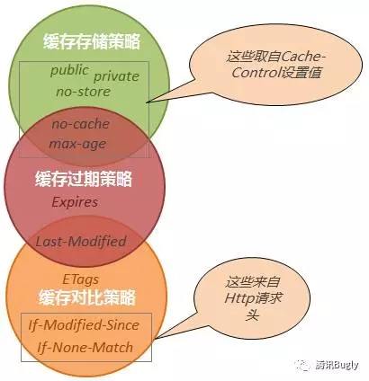

# 1. 缓存存储策略
* 对于 Cache-Control 头里的 Public、Private、no-cache、max-age 、no-store 他们都是用来指明响应内容是否可以被客户端存储的，其中前4个都会缓存文件数据（关于 no-cache 应理解为“不建议使用本地缓存”，其仍然会缓存数据到本地），后者 no-store 则不会在客户端缓存任何响应数据。另关于 no-cache 和 max-age 有点特别，我认为它是一种混合体，下面我会讲到。 
* 通过 Cache-Control：Public 设置我们可以将 Http 响应数据存储到本地，但此时并不意味着后续浏览器会直接从缓存中读取数据并使用，为啥？因为它无法确定本地缓存的数据是否可用（可能已经失效），还必须借助一套鉴别机制来确认才行， 这就是我们下面要讲到的“缓存过期策略”。
# 2. 缓存过期策略
* Expires，Expires 指名了缓存数据有效的绝对时间，告诉客户端到了这个时间点（比照客户端时间点）后本地缓存就作废了，在这个时间点内客户端可以认为缓存数据有效，可直接从缓存中加载展示。
* 不过 Http 缓存头设计并没有想象的那么规矩，像上面提到的 Cache-Control（这个头是在Http1.1里加进来的）头里的 no-cache 和 max-age 就是特例，它们既包含缓存存储策略也包含缓存过期策略，以 max-age 为例，他实际上相当于Cache-Control：public/private（这里不太确定具体哪个）
Expires：当前客户端时间 + maxAge 。
* 而 Cache-Control：no-cache 和 Cache-Control：max-age=0 （单位是秒）相当
- 注意点：
  - 1: Cache-Control 中指定的缓存过期策略优先级高于 Expires，当它们同时存在的时候，后者会被覆盖掉。
  - 2: 缓存数据标记为已过期只是告诉客户端不能再直接从本地读取缓存了，需要再发一次请求到服务器去确认，并不等同于本地缓存数据从此就没用了，有些情况下即使过期了还是会被再次用到，具体下面会讲到。
# 3. 缓存对比策略
* 将缓存在客户端的数据标识发往服务端，服务端通过标识来判断客户端 缓存数据是否仍有效，进而决定是否要重发数据。
  客户端检测到数据过期或浏览器刷新后，往往会重新发起一个 http 请求到服务器，服务器此时并不急于返回数据，而是看请求头有没有带标识（ If-Modified-Since、If-None-Match）过来，如果判断标识仍然有效，则返回304告诉客户端取本地缓存数据来用即可（这里要注意的是你必须要在首次响应时输出相应的头信息（Last-Modified、ETags）到客户端）。至此我们就明白了上面所说的本地缓存数据即使被认为过期，并不等于数据从此就没用了的道理了。 
 


# 第一道题
```java  HTTP/1.1 200 OK
Cache-Control: no-cache
Content-Type: image/png
Last-Modified: Tue, 08 Nov 2016 06:59:00 GMT
Accept-Ranges: bytes
Date: Thu, 10 Nov 2016 02:48:50 GMT
Content-Length: 3534 
```
* 我们上面讲到了 Cache-Control: no-cache 相当于 Cache-Control: max-age=0，且他们都是多重策略头，我们需将其分解：
  Cache-Control: no-cache 等于 Cache-Control: max-age=0，
  接着 Cache-Control: max-age=0 又可分解成Cache-Control: public/private （不确定是二者中的哪一个）
Expires: 当前时间

# 第二道题
```java  HTTP/1.1 200 OK
HTTP/1.1 200 OK
Cache-Control: private
Content-Type: image/png
Last-Modified: Tue, 08 Nov 2016 06:59:00 GMT
Accept-Ranges: bytes
Date: Thu, 10 Nov 2016 02:48:50 GMT
Content-Length: 3534
```
* Cache-Control: private ;Last-Modified: Tue, 08 Nov 2016 06:59:00 GMT,这时我们会发现根本找不到缓存过期策略项
* 在没有提供任何浏览器缓存过期策略的情况下，浏览器遵循一个启发式缓存过期策略：
根据响应头中2个时间字段 Date 和 Last-Modified 之间的时间差值，取其值的10%作为缓存时间周期

# 其他响应头
*  Date 包含了报文创建的日期和时间
*  Age： 当代理服务器用自己缓存的实体去响应请求时，用该头部表明该实体从产生到现在经过多长时间了。